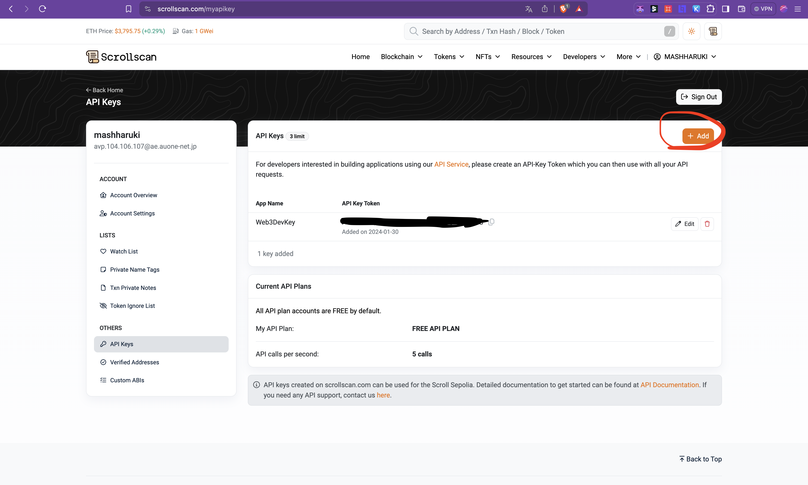
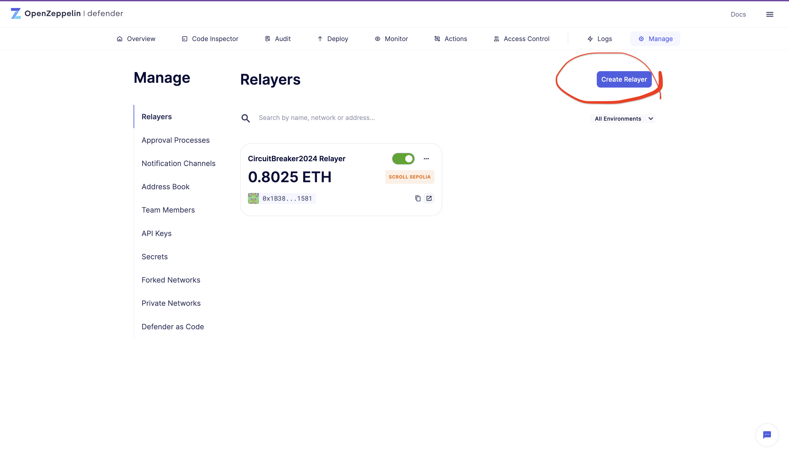
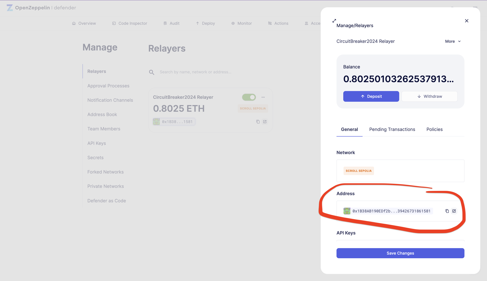
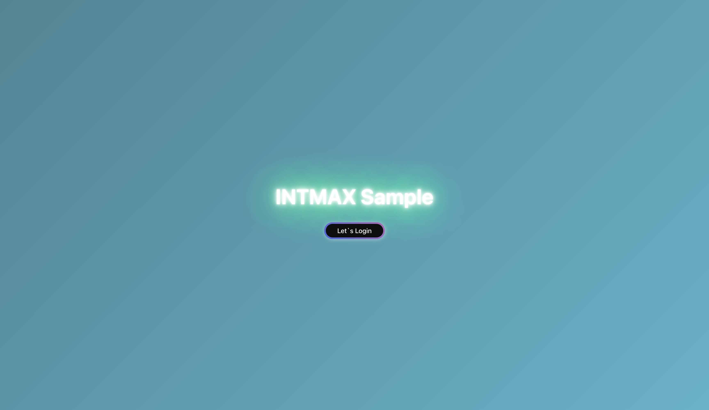
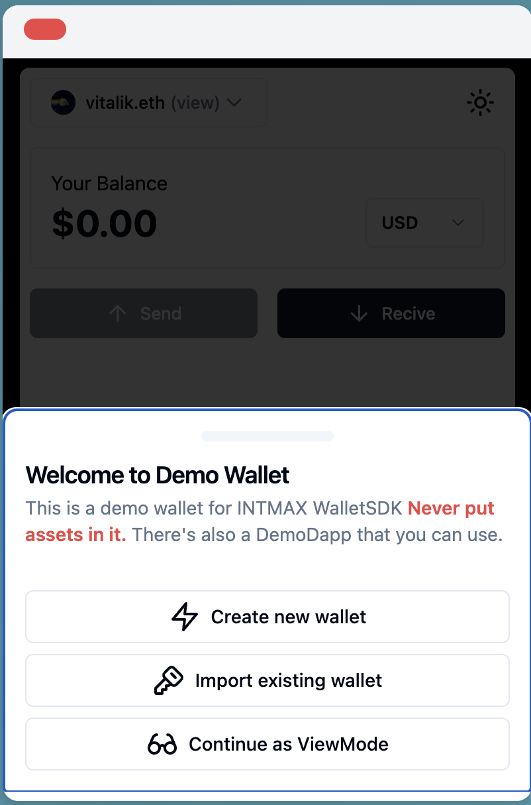
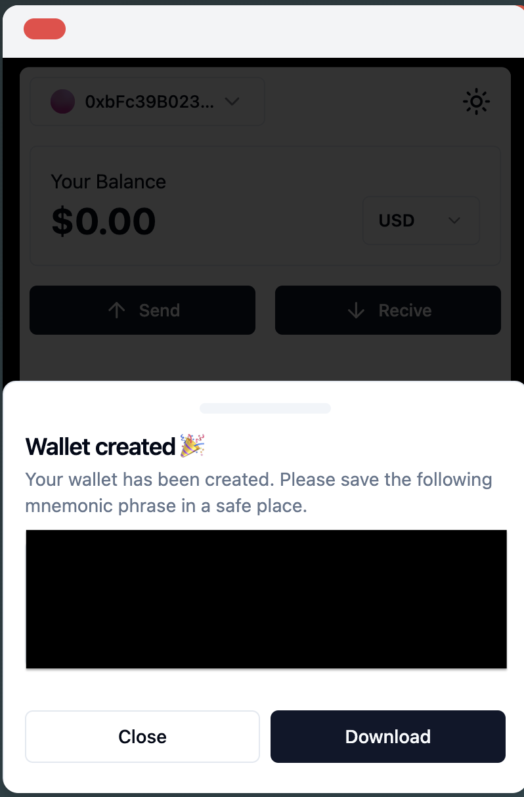
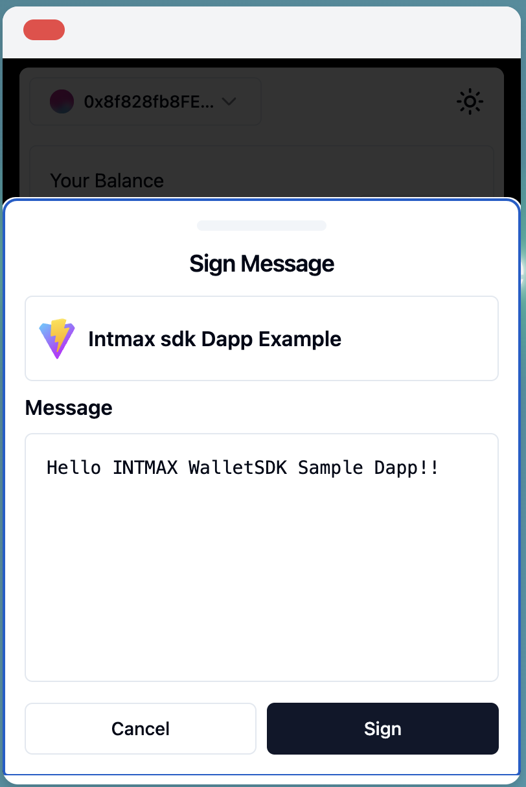
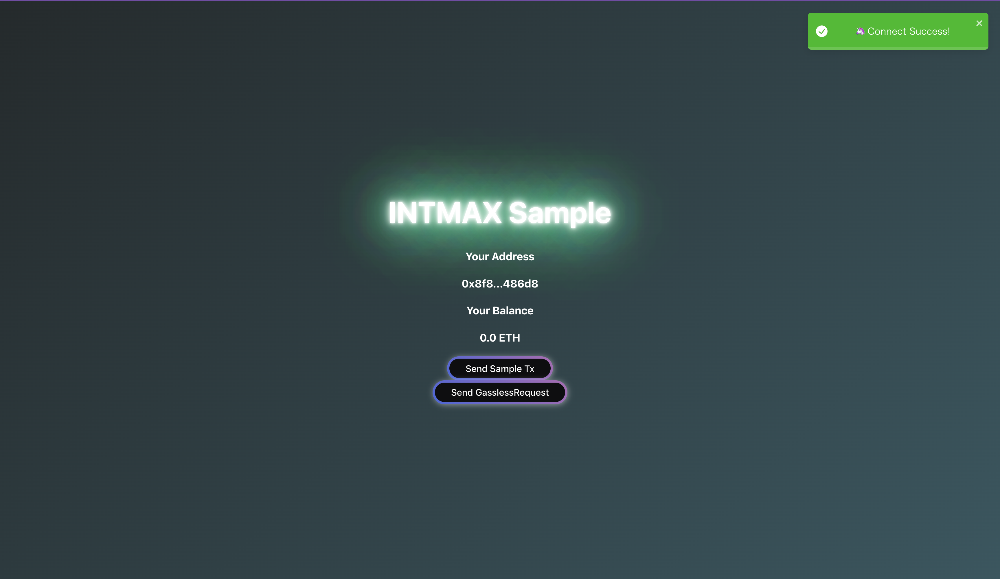
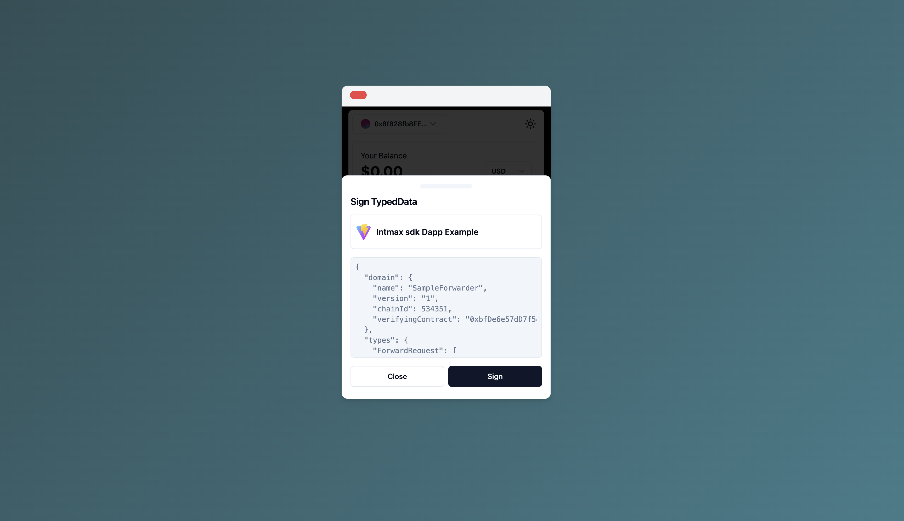
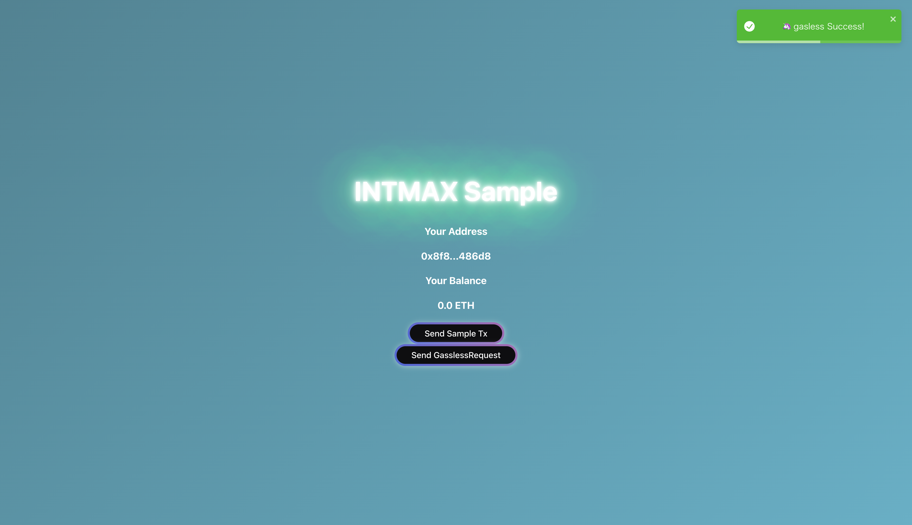

# IntmaxRepo

This repository is for investigating and learning about the stateless rollup INTMAX and INTMAX Wallet.

[](https://github.com/mashharuki/IntmaxRepo/actions/workflows/ci.yml)
[](https://app.netlify.com/sites/intmaxwalletrepo/deploys)

## Notes

The node version must be 18.18.0 or higher!

## How to Start the Sample Application for INTMAX Wallet SDK

- clone git repo.

  ```bash
  git clone https://github.com/mashharuki/IntmaxRepo
  ```

- Preparation

  1.  Obtain Scroll Sepolia faucet

      For example, you can obtain it from the following site:

      - **Covalent faucet**
        - [https://www.covalenthq.com/faucet/](https://www.covalenthq.com/faucet/)
      - **ETHGlobal faucet**
        - [https://ethglobal.com/faucet](https://ethglobal.com/faucet)
      - **A site recommended by Scroll for obtaining a faucet**
        - [https://docs.scroll.io/en/user-guide/faucet/](https://docs.scroll.io/en/user-guide/faucet/)

      Access any site where you can obtain the Scroll Sepolia faucet and get the faucet there!

  2.  Obtain the ScrollScan API

      You will use this to verify the deployed contract, so access the following site to create an API key.

      **ScrollScan API Key**
      - [https://scrollscan.com/myapikey](https://scrollscan.com/myapikey)

      

  3.  Log in to OpenZeppelin Defender and create a Relayer on ScrollSepolia, then obtain the API key.

      **OpenZeppelin Defender Relayer**
      - [https://defender.openzeppelin.com/v2/#/manage/relayers](https://defender.openzeppelin.com/v2/#/manage/relayers)

      

      ＊Sure, please provide the information you'd like to copy and save for later use as environment variables.  
      

  4.  Please send approximately 0.5 Sepolia ETH to the wallet address of the Relayer you created earlier. You can do this on Scroll Sepolia.

      ****OpenZeppelin** Defender - Relayer Address - ScrollScan**
      - [https://sepolia.scrollscan.dev/address/0x1B38AB190EDf2bb4BcB2EC0b6639426731861581](https://sepolia.scrollscan.dev/address/0x1B38AB190EDf2bb4BcB2EC0b6639426731861581)

      

      Please deposit approximately 0.5 Sepolia ETH to each of the Relayer addresses you have created. 

  5. Additionally, send a small amount of ETH (around 0.5 Sepolia ETH) to the wallet address you will use for deploying contracts. You can perform these transactions on Scroll Sepolia.

  6.  Setting Environment Variables

      Environment variables should be configured separately for `backend` and `frontend`.

      - Configuration of `backend` environment variables

        Create a `.env` file under the `backend` folder.

        ```bash
        cp pkgs/backend/.env.example pkgs/backend/.env
        ```

        Sure, please provide the specific environment variables you'd like to set.

        ```txt
        PRIVATE_KEY=
        SCROLLSCAN_API_KEY=
        DEFENDER_API_KEY=
        DEFENDER_SECRET_KEY=
        ```

        Copy & paste the PRIVATE_KEY from Metamask.

        Paste the `SCROLLSCAN_API_KEY`, `DEFENDER_API_KEY` and `DEFENDER_SECRET_KEY` obtained above.

      - Setting `frontend` environment variables

        Create a `.env.local` file in the `frontend` folder.

        ```bash
        cp pkgs/frontend/.env.local.example pkgs/frontend/.env.local
        ```

        Sure, please provide the specific environment variables you'd like to set.

        ```txt
        NEXT_PUBLIC_APP_ICON="https://intmaxwallet-sdk-wallet.vercel.app/vite.svg"
        NEXT_PUBLIC_WALLET_URL="https://intmaxwallet-sdk-wallet.vercel.app/"
        NEXT_PUBLIC_RPC_URL="https://sepolia-rpc.scroll.io/"
        DEFENDER_API_KEY=
        DEFENDER_SECRET_KEY=
        ```

        `The DEFENDER_API_KEY` and `DEFENDER_SECRET_KEY` should be copied from the above and pasted.

- install

  ```bash
  yarn
  ```

- compile SmartContract 

  ```bash
  yarn backend compile
  ```

- test SmartContract

  ```bash
  yarn backend test
  ```

- deploy SmartContract

  ```bash
  yarn backend deploy --network scrollSepolia
  ```

  The address of the deployed contract will be recorded in `pkgs/backend/outputs/contracts-scrollSepolia.json`.

  If the deployment is unsuccessful, try using the following addresses of the already deployed contracts!

  Deployed SmartContract (ScrollSepolia)

  [SampleForwarder](https://sepolia.scrollscan.com/address/0x32F9d19A89b65F91da684ee25136CF692673A160#code)

  [HelloWorld](https://sepolia.scrollscan.com/address/0x5e86a9F80E4Dec74573fe75F62090Cb28a1B5760#code)

- Update the values in the frontend constants file.

  Update the contract addresses in `pkgs/frontend/src/utils/constants.ts` to the addresses of the contracts deployed above.  
  ※ If deployment is unsuccessful, please use the values already pasted.

  ```ts
  export const FORWARDER_CONTRACT_ADDRESS =　<deployed Contract's Address>;
  export const HELLOWORLD_CONTRACT_ADDRESS = <deployed Contract's Address>;
  ```

- verify contract **(option)**

  ```bash
  yarn backend verify --network scrollSepolia
  ```

- Calling functions of a sample contract gaslessly **(option)**

  ```bash
  yarn backend gaslessSetNewText --network scrollSepolia
  ```

  execute the contents of the `/pkgs/backend/scripts/relay/gaslessSetScore.ts` file!!

  Using the functionalities of OZ Defender, I'm running transactions from the relayer!!

  ```ts
  /**
   * レイヤー用のSignerオブジェクトを作成するメソッド
   */
  const getRelayer = async () => {
    const credentials: any = {
      apiKey: DEFENDER_API_KEY,
      apiSecret: DEFENDER_SECRET_KEY,
    };

    const ozProvider = new DefenderRelayProvider(credentials);
    const ozSigner = new DefenderRelaySigner(credentials, ozProvider, {
      speed: "fast",
    });

    return ozSigner;
  };
  ```

- retrieve the Text value stored in the contract.

  The initial value should be 'newText'.

  ```bash
  yarn backend getText --network scrollSepolia
  ```

- build frontend

  ```bash
  yarn frontend build
  ```

- start frontend

  ```bash
  yarn frontend dev
  ```

  access to [http://localhost:3000](http://localhost:3000)

  When the following screen appears, click the "Let's Login" button!

  

  If it's your first time, you'll be asked if you want to create a new wallet since there isn't one.

  Select `Create new wallet` to proceed with creating a new wallet.

  

  Take note or download the mnemonic code shown to you to ensure you don't forget it.

  

  Click the `Close` button to connect to the site.

  

  When a popup appears, click the "Sign" button!

  

  If everything goes well, the methods of the INTMAX Wallet SDK will be invoked, and your wallet will be created!

- Let's update the value stored in the contract gaslessly.

  Once your wallet is successfully created, it's time to execute the gasless transaction!

  Click the `SendGaslessRequest` button.

  

  When the popup appears, click the `Sign` button!

  

  Once a popup saying "Success" appears, click OK!

  

  Additionally, check the console for logs of API processing. 

  Confirm that transaction data is outputted as follows: if so, it's okay

  ```bash
  ========================================= [RequestRaler: START] ==============================================
  request: {
    from: '0xbFc39B0230D743C8F7FAb716E622C1FD2894B148',
    to: '0xEbdef95c2f60D070bD5f10E9D69F55943169A108',
    value: 0n,
    gas: 360000n,
    nonce: 5n,
    deadline: 1717898498n,
    data: '0x2742d0f60000000000000000000000000000000000000000000000000000000000000020000000000000000000000000000000000000000000000000000000000000000f68656c6c6f20494e544d41585821210000000000000000000000000000000000',
    signature: '0xd13fbf2b821d44c80dee699982183a47b34eb2b2fa29cb179478e41cc4f8dcce041bdd1e0106a1476d7843ea9f79418ee9e3db16273fa098bbfa305f84ba905e1c'
  }
  true
  tx hash: 0x95d24a93afeb154397b92f672fb500d6db52c80ee4ea9e4f13bcc67f66fe6c75
  ========================================= [RequestRaler: END] ==============================================
  ```

  If you see logs like this, the gasless transaction has been successfully issued!!

- Retrieve the Text value stored in the contract once again.

  The initial value was an empty string, but you should now retrieve the phrase "hello INTMAXX!!".  
  ※ If it hasn't been updated, please try again later.

  Open a new tab and execute the following.

  ```bash
  yarn backend getText --network scrollSepolia
  ```

## Explanation of the source code (related to the INTMAX Wallet SDK)

All implementations related to the INTMAX Wallet SDK are consolidated in `pkgs/frontend/src/context/IntmaxProvider.tsx`!

This file implements the following features:

1. A method to generate an instance for the SDK
2. A method to connect
3. A method to send transactions
4. A method to send gasless transactions

I'll explain each in order.

For item 1, it is implemented using ethereumProvider and intmaxDappClient from intmax-walletsdk/dapp!

```ts
/**
 * SDK用のインスタンスを生成するメソッド
 * @param walletUrl
 * @returns
 */
const createSdk = () => {
  setLoading(true);

  try {
    const client = intmaxDappClient({
      wallet: {
        url: DEFAULT_WALLET_URL,
        name: "DEMO Wallet",
        window: { mode: "iframe" }, // modeは iframeかpopupを選択できる
      },
      metadata: DAPP_METADATA,
      providers: {
        eip155: ethereumProvider({
          httpRpcUrls: {
            534351: RPC_URL, // 今回はScroll Sepoliaに接続するように設定
          },
        }),
      },
    });
    // SDK インスタンスをセット
    setSdk(client);
    return client;
  } catch (err: any) {
    console.error("err:", err);
  } finally {
    setLoading(false);
  }
};
```

With this, we're ready to connect!

For item 2, we use the instance created in item 1 to connect.  
※Note: This also simultaneously calls the eth_sign API for signing!

```ts
const sdk = createSdk();

const ethereum = sdk!.provider(`eip155:${CHAIN_ID}`);
// ウォレット情報を取得する。
await ethereum.request({ method: "eth_requestAccounts", params: [] });
const accounts = (await ethereum.request({
  method: "eth_accounts",
  params: [],
})) as string[];
console.log("Account Info:", accounts);
setAccounts(accounts);
setAddress(accounts[0]);

// ログイン時に署名
const result = await ethereum.request({
  method: "eth_sign",
  params: [accounts[0], "Hello INTMAX WalletSDK Sample Dapp!!"],
});
console.log(result);
```

For item 3, we similarly use the instance created in item 1 to send transactions.

```ts
/**
 * トランザクションを送信するメソッド
 */
const sendTx = async (to: string, value: string) => {
  const ethereum = await sdk.provider(`eip155:${CHAIN_ID}`);

  setLoading(true);
  try {
    // send Simple Transaction
    const result = await ethereum.request({
      method: "eth_sendTransaction",
      params: [
        {
          from: address,
          to: to,
          value: parseEther(value),
        },
      ],
    });

    console.log("tx info:", `https://sepolia.etherscan.io/tx/${result}`);

    // .. 以下略
  } catch (err: any) {
    console.error("error:", err);
    // .. 以下略
  } finally {
    // .. 以下略
  }
};
```

For item 4, the process is almost the same as before. Here, we call the eth_signTypedData_v4 API to generate the signature data used in meta-transactions.

The remaining implementation follows almost the same process as for implementing meta-transactions!

```ts
/**
 * ガスレスでコントラクトのメソッドを呼び出す
 */
const gasslessRequest = async () => {
  console.log(
    "================================= [gasless: START] ================================="
  );

  const ethereum = await sdk.provider(`eip155:${CHAIN_ID}`);
  const provider = await new ethers.JsonRpcProvider(RPC_URL);

  setLoading(true);
  try {
    // create forwarder contract instance
    const forwarder: any = new Contract(
      FORWARDER_CONTRACT_ADDRESS,
      SampleForwarderJson.abi,
      provider
    ) as any;
    // create ScoreValut contract instance
    const helloWorld: any = new Contract(
      HELLOWORLD_CONTRACT_ADDRESS,
      HelloWorldJson.abi,
      provider
    ) as any;

    // 呼び出すメソッドのエンコードデータを用意
    // 今回は"hello INTMAXX!!"という文字列を引数にして HelloWorldコントラクトのsetNewTextメソッドを呼び出したいと思います！
    const encodedData: any = helloWorld.interface.encodeFunctionData(
      "setNewText",
      ["hello INTMAXX!!"]
    );

    // get domain
    const domain = await forwarder.eip712Domain();
    // get unit48
    const uint48Time = getUint48();

    console.log("encodedData:", encodedData);
    console.log("domain:", domain);
    console.log("uint48Time:", uint48Time);

    // test sign messages
    const typedData = {
      domain: {
        name: domain[1],
        version: domain[2],
        chainId: CHAIN_ID, // scroll sepolia
        verifyingContract: domain[4].toString(),
      },
      types: {
        ForwardRequest: ForwardRequest,
      },
      primaryType: "ForwardRequest",
      message: {
        from: address.toString(),
        to: HELLOWORLD_CONTRACT_ADDRESS.toString(),
        value: 0,
        gas: 360000,
        nonce: (await forwarder.nonces(address)).toString(),
        deadline: uint48Time.toString(),
        data: encodedData.toString(),
      },
    };

    // create request data
    // eth_signTypedData_v4 のAPIを使って署名データを作成
    const sig = await ethereum.request({
      method: "eth_signTypedData_v4",
      params: [address, JSON.stringify(typedData)],
    });

    console.log("sig:", sig);

    // call requestRelayer API
    const gaslessResult = await fetch("/api/requestRelayer", {
      method: "POST",
      headers: {
        "Content-Type": "application/json",
      },
      body: JSON.stringify({
        from: address,
        to: HELLOWORLD_CONTRACT_ADDRESS,
        value: 0,
        gas: 360000,
        nonce: (await forwarder.nonces(address!)).toString(),
        deadline: uint48Time.toString(),
        data: encodedData,
        signature: sig,
      }),
    });

    console.log(await gaslessResult.json());

    // .. 以下略
  } catch (err: any) {
    // .. 以下略
  } finally {
    // .. 以下略
  }
};
```

### 参考文献

Here are the websites and documents I referred to!

I've also included links that seem useful for learning about other ZK rollups.

1. [Scaling Ethereum 2023](https://ethglobal.com/events/scaling2023/prizes/intmax-intmax-5ejin)
2. [GitHub - webmax.js Public](https://github.com/InternetMaximalism/webmax.js)
3. [Intmax Wallet](https://drive.google.com/file/d/16AcEheRMEtX9GgjOcQiFQZNQR8ZCPAS0/view)
4. [IntMax の公式サイト](https://intmax.io/)
5. [GetStarted](https://docs.testnet.intmax.io/getting-started/overview)
6. [Scroll bridge](https://scroll.io/bridge)
7. [CLI のガイドライン](https://docs.testnet.intmax.io/getting-started/interface-guide)
8. [intmax rolluo cli](https://github.com/InternetMaximalism/intmax-rollup-cli)
9. [hardhat-Plugin](https://github.com/mashharuki/intmax-interoperability-plugin)
10. [Sample-Auction-dapp](https://github.com/InternetMaximalism/intmax-rollup-cli/tree/main/packages/sample-auction-app/ethereum)
11. [PRTIMES - INTMAX Walletless Wallet](https://prtimes.jp/main/html/rd/p/000000004.000110841.html)
12. [INTMAX Wallet Home Page](https://home.wallet.intmax.io/)
13. [GitHub - intmax-walletsdk](https://github.com/InternetMaximalism/intmax-walletsdk)
14. [npm - INTMAX WalletSDK](https://www.npmjs.com/package/intmax-walletsdk)
15. [INTMAX WalletSDK サンプル実装](https://github.com/InternetMaximalism/intmax-walletsdk/blob/main/examples/dapp/src/App.tsx)
16. [INTMAX Wallet SDK - GitBook](https://intmax-wallet.gitbook.io/intmax-walletsdk)
17. [レイヤー 2「INTMAX」とは？真の金融インフラを開発する日置玲於奈氏の展望に迫る](https://meta-bank.jp/theme/intmax-hioki/)
18. [INTMAX、「Plasma Next」メイネット α をローンチ。Plasma の完成により拡張性向上](https://news.yahoo.co.jp/articles/741cb91f613971f44d91a8c982a5bf49bf955e4d)
19. [大衆向けイーサリアムのスケーリング: INTMAX が Plasma Next を発表](https://hackernoon.com/ja/%E5%A4%A7%E8%A1%86%E5%90%91%E3%81%91%E3%82%A4%E3%83%BC%E3%82%B5%E3%83%AA%E3%82%A2%E3%83%A0%E3%81%AE%E3%82%B9%E3%82%B1%E3%83%BC%E3%83%AA%E3%83%B3%E3%82%B0-intmax-%E3%81%8C%E6%AC%A1%E3%81%AB%E3%83%97%E3%83%A9%E3%82%BA%E3%83%9E%E3%82%92%E7%99%BA%E8%A1%A8)
20. [INTMAX ホワイトペーパー](https://eprint.iacr.org/2023/1082.pdf)
21. [Plasma Next: Plasma without Online Requirements](https://hackmd.io/@leonahioki/SJQixupj6)
22. [Youtube - INTMAX のステートレスなロールアップが他の ZK ロールアップと何が違うのが概要だけ解説してくれている動画](https://youtu.be/RFoK4WL6mZo?si=ogZX8o4EVUT2MgDW)
23. [【完全保存版】zkEVM とは何か](https://zenn.dev/thirdweb_jp/articles/1ff655d56a1120)
24. [初心者向け: #zkEVM とは？](https://note.com/0xpolygon_japan/n/n892efeec12c5)
25. [いま話題の「zkEVM」とは何か？～農業への応用を考察～](https://note.com/noujoujin/n/nc57bda20b4ba)
26. [イーサリアム開発者ドキュメント - プラズマチェーンとは何か？](https://ethereum.org/ja/developers/docs/scaling/plasma/)
27. [レイヤー 2 技術の Plasma は、提案から 2 年を経て実用段階に近づく＝ BlockChainJam 2019](https://crypto.watch.impress.co.jp/docs/event/1220922.html)
28. [ヴィタリック、スケーリングソリューション「Plasma」の評価を再検討すべきと主張](https://www.neweconomy.jp/posts/353238)
29. [GitHub - Plasma ホワイトペーパー日本語訳](https://github.com/mashharuki/plasma-whitepaper-jp)
30. [Medium - Recursive Zero-Knowledge Proofs](https://scryptplatform.medium.com/recursive-zero-knowledge-proofs-27f2d934f953)
31. [Intmax Wallet SDKのサンプル実装例を取り上げたブログ記事](https://medium.com/@intmaxafrica/how-to-integrate-intmax-wallet-into-your-dapp-using-rainbowkit-b363eb9c6fce)
