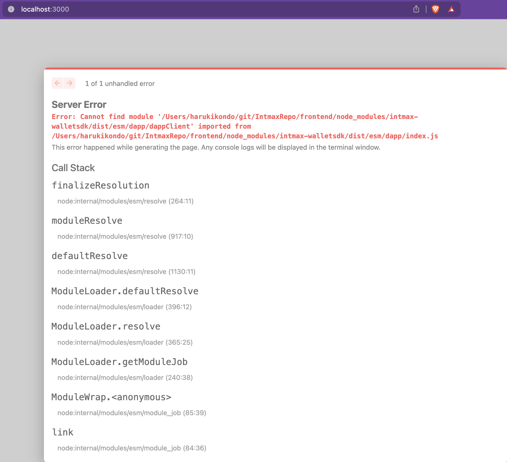
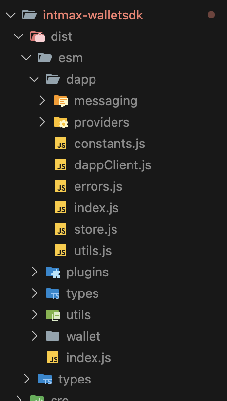
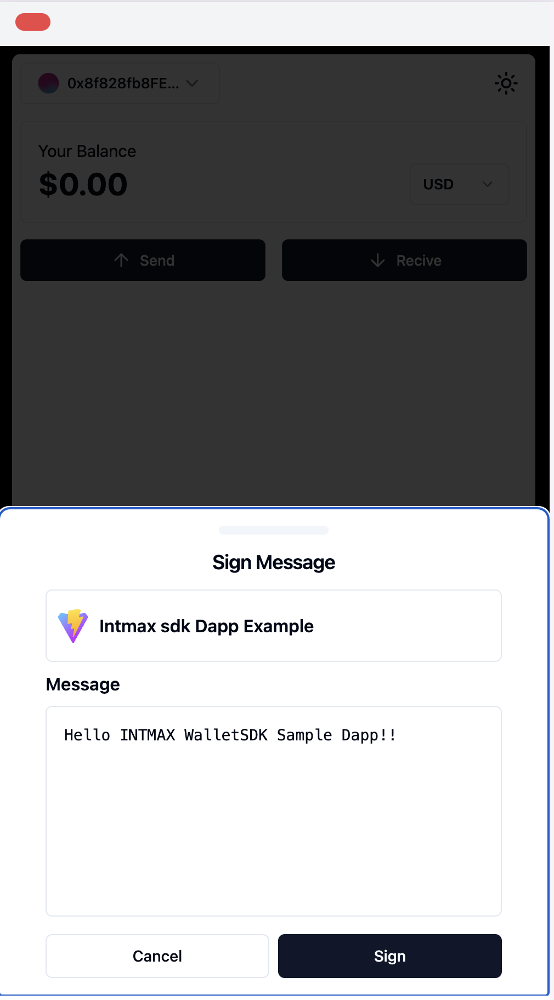

# WalletSDK について質問メモ 【2024 年 4 月】

## やろうとしたこと

Next.js + TypeScript の構成をベースに WalletSDK を使ったハンズオン用のサンプルアプリケーションを動かそうとしていました。  
※ 座学編で勉強した後にみんなで手を動かしてみるために使ってみたいと思っています。

## 作業フォルダ

`frontend`フォルダ配下のソースコードで作業していました。

## 環境・バージョン情報など

- yarn  
  1.22.19
- node  
  v20.11.0
- next.js  
  13.5.4
- ethers  
  6.12.0
- intmax-walletsdk  
  0.0.3

## 実行したコマンド

- intmax-walletsdk のインストールのために下記コマンドを実行

  ```bash
  yarn add intmax-walletsdk
  ```

- フロントエンド起動は下記にて実行

  ```bash
  yarn dev
  ```

## 設定系

下記 3 つの環境変数の値をセット

```txt
NEXT_PUBLIC_APP_ICON="https://intmaxwallet-sdk-wallet.vercel.app/vite.svg"
NEXT_PUBLIC_WALLET_URL="https://intmaxwallet-sdk-wallet.vercel.app/"
NEXT_PUBLIC_RPC_URL="https://eth-sepolia.g.alchemy.com/v2/APIKEY"
```

## 実装について

SDK 用のインスタンスの生成やトランザクションへの送信などのロジックは全て`context/IntmaxProvider.tsx`にまとめて実装しています。

[インスタンスを作成するところ](https://github.com/mashharuki/IntmaxRepo/blob/main/frontend/src/context/IntmaxProvider.tsx#L14-L57)

[connect するところ](https://github.com/mashharuki/IntmaxRepo/blob/main/frontend/src/context/IntmaxProvider.tsx#L62-L122)

[トランザクションを送信するところ](https://github.com/mashharuki/IntmaxRepo/blob/main/frontend/src/context/IntmaxProvider.tsx#L127-L173)

## エラー内容

フロントエンドを起動して `localshost:3000`にアクセスしたところ以下のようなエラーが発生してうまくアプリが立ち上がらないという事象が発生しています。

```bash
Server Error
Error: Cannot find module '/Users/harukikondo/git/IntmaxRepo/frontend/node_modules/intmax-walletsdk/dist/esm/dapp/dappClient' imported from /Users/harukikondo/git/IntmaxRepo/frontend/node_modules/intmax-walletsdk/dist/esm/dapp/index.js

This error happened while generating the page. Any console logs will be displayed in the terminal window.
```



`'ERR_MODULE_NOT_FOUND'` ということで `node_modules/intmax-walletsdk/dist/esm/dapp/dappClient`が見つからない(参照できていない？)エラーが出ています。

`node_modules/intmax-walletsdk/dist/esm/dapp/dappClient`を確認したのですがファイルがあったのでインストールはできていそうでした。



## 試したこと

試したことは以下の通りです。

1. バージョン 0.0.2 に切り替えて試してみました。  
   ⇨ やはり同じエラーが出ました・・。

2. 公開されているサンプルアプリと同じ場所で動かしてみました。

   [https://github.com/InternetMaximalism/intmax-walletsdk/tree/main/examples](https://github.com/InternetMaximalism/intmax-walletsdk/tree/main/examples)

   ここに格納されている 3 つのサンプル実装例を参考にしてみました。

   ローカルにクローンしてきて ここに自分が作ったサンプルコードをそのまま突っ込んで`package.json`の `intmax-walletsdk`のところを以下のように設定し直しました。

   ```json
   "intmax-walletsdk": "workspace:^"
   ```

   それで起動したらこちらでは動かせましたが、やっぱりこの構成でないとうまく動かせなかったです・・。

   

   独立した Next.js のプロジェクトで動かす上でその他考慮すべき点がありましたらご教示いただけると幸いです。

## 参照したドキュメントや実装例

1. [INTMAX Wallet Home Page](https://home.wallet.intmax.io/)
2. [GitHub - intmax-walletsdk](https://github.com/InternetMaximalism/intmax-walletsdk)
3. [npm - INTMAX WalletSDK](https://www.npmjs.com/package/intmax-walletsdk)
4. [INTMAX WalletSDK サンプル実装](https://github.com/InternetMaximalism/intmax-walletsdk/blob/main/examples/dapp/src/App.tsx)
5. [INTMAX Wallet SDK - GitBook](https://intmax-wallet.gitbook.io/intmax-walletsdk)
